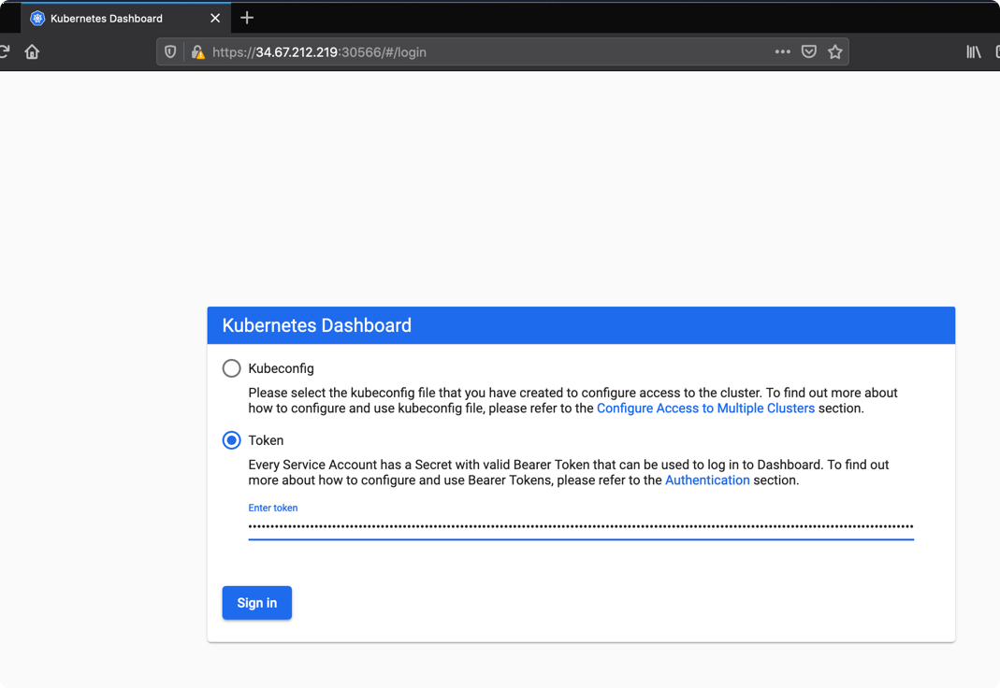
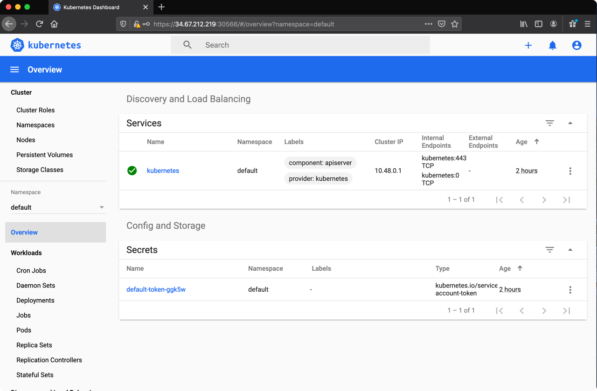

## Steps

```bash
$ cd kubernetes-kitchen/gcp/task1-k8s-dashboard

$ kubectl apply -f .

$ kubectl get service kubernetes-dashboard -n kubernetes-dashboard
NAME                   TYPE       CLUSTER-IP    EXTERNAL-IP   PORT(S)         AGE
kubernetes-dashboard   NodePort   10.48.8.193   <none>        443:30566/TCP   16m

$ gcloud compute firewall-rules create node-port-30566 --allow tcp:30566
Creating firewall...⠹Created [https://www.googleapis.com/compute/v1/projects/gcloud-262311/global/firewalls/node-port-30566].
Creating firewall...done.
NAME             NETWORK  DIRECTION  PRIORITY  ALLOW      DENY  DISABLED
node-port-30566  default  INGRESS    1000      tcp:30566        False

$ kubectl get nodes --output wide
NAME                                       STATUS   ROLES    AGE    VERSION           INTERNAL-IP   EXTERNAL-IP     
gke-cluster-2-default-pool-43440158-7dk0   Ready    <none>   148m   v1.14.10-gke.27   10.128.0.35   34.67.212.219

$ kubectl -n kube-system describe secret $(kubectl -n kube-system get secret | grep eks-admin | awk '{print $1}')
Name:         eks-admin-token-xcms9
Namespace:    kube-system
Labels:       <none>
Annotations:  kubernetes.io/service-account.name: eks-admin
            kubernetes.io/service-account.uid: d96d7ddc-74cb-11ea-802a-42010a8001ab

Type:  kubernetes.io/service-account-token

Data
====
ca.crt:     1115 bytes
namespace:  11 bytes
token:      COPY_THIS_VALUE
```

- Now visit the following on firefox and give the token copied above

> https://34.67.212.219:30566



- Post login screen



