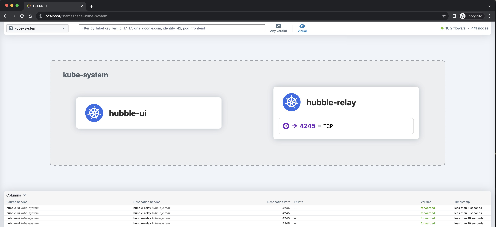

# Cilium

- [Cilium : Installation with K8s distributions » Installation Using Kind](https://docs.cilium.io/en/stable/installation/kind/#gs-kind)
- [Cilium : Github - cilium/cilium](https://github.com/cilium/cilium)
- [Kind : Ingress](https://kind.sigs.k8s.io/docs/user/ingress/)
- [Cilium : hubble-setup](https://docs.cilium.io/en/stable/gettingstarted/hubble_setup/#hubble-setup)

## [What is Cilium](https://docs.cilium.io/en/stable/overview/intro/#what-is-cilium)?

Cilium is open source software for transparently securing the network connectivity between application services deployed using Linux container management platforms like Docker and Kubernetes.

At the foundation of Cilium is a new Linux kernel technology called eBPF, which enables the dynamic insertion of powerful security visibility and control logic within Linux itself. Because eBPF runs inside the Linux kernel, Cilium security policies can be applied and updated without any changes to the application code or container configuration.

## [What is Hubble?](https://docs.cilium.io/en/stable/overview/intro/#what-is-hubble)

Hubble is a fully distributed networking and security observability platform. It is built on top of Cilium and eBPF to enable deep visibility into the communication and behavior of services as well as the networking infrastructure in a completely transparent manner.

## [Cilium component overview](https://docs.cilium.io/en/stable/overview/component-overview/#cilium)

- Create cluster

```bash
$ kind create cluster --config=kind-config.yaml
.
$ kubectl get nodes             
NAME                 STATUS     ROLES           AGE   VERSION
kind-control-plane   NotReady   control-plane   28s   v1.25.3
kind-worker          NotReady   <none>          9s    v1.25.3
kind-worker2         NotReady   <none>          9s    v1.25.3
kind-worker3         NotReady   <none>          9s    v1.25.3
```

- Install Cilium

```bash
$ helm repo add cilium https://helm.cilium.io/
.
# To avoid errors like : Error: INSTALLATION FAILED: failed to download "cilium/cilium" at version "1.14.0", Run
$ helm repo update
$ docker pull quay.io/cilium/cilium:v1.14.0
$ kind load docker-image quay.io/cilium/cilium:v1.14.0


$ helm install cilium cilium/cilium --version 1.14.0 \
   --namespace kube-system \
   --set image.pullPolicy=IfNotPresent \
   --set ipam.mode=kubernetes \
   --set hubble.relay.enabled=true \
   --set hubble.ui.enabled=true

$ docker exec kind-control-plane ls -al /proc/self/ns/cgroup
lrwxrwxrwx 1 root root 0 Jul 26 18:24 /proc/self/ns/cgroup -> cgroup:[4026532854]
$ docker exec kind-worker ls -al /proc/self/ns/cgroup
lrwxrwxrwx 1 root root 0 Jul 26 18:24 /proc/self/ns/cgroup -> cgroup:[4026532741]
```

- Validate Installation

```bash
$ kubectl -n kube-system get pods --watch
NAME                                         READY   STATUS    RESTARTS   AGE
cilium-854gh                                 1/1     Running   0          4m44s
cilium-jfkkl                                 1/1     Running   0          4m44s
cilium-jrbvn                                 1/1     Running   0          4m44s
cilium-operator-fdc5f8984-lfclj              1/1     Running   0          4m44s
cilium-operator-fdc5f8984-nggwz              1/1     Running   0          4m44s
cilium-z9x2s                                 1/1     Running   0          4m44s
coredns-565d847f94-hjs7x                     1/1     Running   0          6m5s
coredns-565d847f94-q4tzq                     1/1     Running   0          6m5s
etcd-kind-control-plane                      1/1     Running   0          6m18s
hubble-relay-6d4fdf8848-94fhl                1/1     Running   0          4m44s
hubble-ui-77f55d6655-fnql9                   2/2     Running   0          4m44s
kube-apiserver-kind-control-plane            1/1     Running   0          6m18s
kube-controller-manager-kind-control-plane   1/1     Running   0          6m18s
kube-proxy-9s75j                             1/1     Running   0          6m2s
kube-proxy-hwh7l                             1/1     Running   0          6m2s
kube-proxy-jlfkn                             1/1     Running   0          6m2s
kube-proxy-tf8k6                             1/1     Running   0          6m5s
kube-scheduler-kind-control-plane            1/1     Running   0          6m18s

$ kubectl create ns cilium-test
namespace/cilium-test created

$ kubectl apply -n cilium-test -f https://raw.githubusercontent.com/cilium/cilium/1.14.0/examples/kubernetes/connectivity-check/connectivity-check.yaml

$ kubectl get pods -n cilium-test
NAME                                                     READY   STATUS    RESTARTS        AGE
echo-a-65c9d9654-dcnhb                                   1/1     Running   0               8m56s
echo-b-6868474864-7m6lw                                  1/1     Running   0               8m56s
echo-b-host-548c898ddb-pwdt8                             1/1     Running   0               8m56s
host-to-b-multi-node-clusterip-5db74f65cf-t5phl          1/1     Running   6 (2m24s ago)   8m55s
host-to-b-multi-node-headless-bb955b8c9-rdrcw            1/1     Running   6 (2m24s ago)   8m54s
pod-to-a-allowed-cnp-85776ff48c-7bslc                    1/1     Running   0               8m55s
pod-to-a-b7b7b554f-n9f9q                                 1/1     Running   0               8m56s
pod-to-a-denied-cnp-7c5c6bd5b9-p64cr                     1/1     Running   0               8m56s
pod-to-b-intra-node-nodeport-76dbd989b7-hlkth            1/1     Running   0               8m54s
pod-to-b-multi-node-clusterip-59448f789c-924gx           1/1     Running   0               8m55s
pod-to-b-multi-node-headless-6f9999647f-f7j2b            1/1     Running   0               8m55s
pod-to-b-multi-node-nodeport-6c465c7979-z5wsd            1/1     Running   0               8m54s
pod-to-external-1111-664d5cbd5f-s2r8p                    1/1     Running   0               8m56s
pod-to-external-fqdn-allow-google-cnp-5d6bd8986f-6l6mr   1/1     Running   0               8m55s

$ kubectl delete ns cilium-test
```

- Access the UI

```bash
$ kubectl get pods -A | grep ui                                           
kube-system          hubble-ui-77f55d6655-fnql9                   2/2     Running   0          19m
$ kubectl port-forward -n kube-system hubble-ui-77f55d6655-fnql9 8080:8081
Forwarding from 127.0.0.1:8080 -> 8081

# from svc
$ kubectl get svc -A | grep ui
kube-system     hubble-ui                            ClusterIP   10.96.121.42    <none>        80/TCP                       19m

# Note that output says it's forwarding to container
# 127.0.0.1:8081 -----> 80 ------> 8081
$ kubectl port-forward -n kube-system svc/hubble-ui 8081:80
Forwarding from 127.0.0.1:8081 -> 8081
Forwarding from [::1]:8081 -> 8081
```

- Deploy nginx ingress
  - [Github Issues: Empty reply from server" when using Ingress](https://github.com/kubernetes-sigs/kind/issues/1618#issuecomment-1166358484)
  - [Github Issues: ingress is not listening on port 80](https://github.com/kubernetes/ingress-nginx/issues/4799#issuecomment-560406420)
  - [Github Issues: ingress is not listening on port 80](https://github.com/kubernetes/ingress-nginx/issues/4799#issuecomment-560132322)

> If that's empty I assume you are trying to use the ingress controller in bare-metal (or docker in docker)
> In that case you cannot use a service type=LoadBalancer.
> We are using docker in docker

```bash
$ kubectl apply -f https://raw.githubusercontent.com/kubernetes/ingress-nginx/main/deploy/static/provider/kind/deploy.yaml
.

$ kubectl get deployment -n ingress-nginx
NAME                       READY   UP-TO-DATE   AVAILABLE   AGE
ingress-nginx-controller   1/1     1            1           8m6s


$ kubectl patch deployment ingress-nginx-controller -p '{"spec":{"template":{"spec":{"hostNetwork":true}}}}' -n ingress-nginx

$ kubectl wait --namespace ingress-nginx \
  --for=condition=ready pod \
  --selector=app.kubernetes.io/component=controller \
  --timeout=90s
```

- Deploy the ingress resource

```bash
$ kubectl apply -f ingress.yaml                                                                                           
ingress.networking.k8s.io/hubble-ui created
```

- Now we can visit [http://localhost](http://localhost)

> Note: We are using nginx ingress and not cilium ingress, so we do not need the things mentioned here - [Service Mesh » Kubernetes Ingress Support
](https://docs.cilium.io/en/stable/network/servicemesh/ingress/#gs-ingress)


