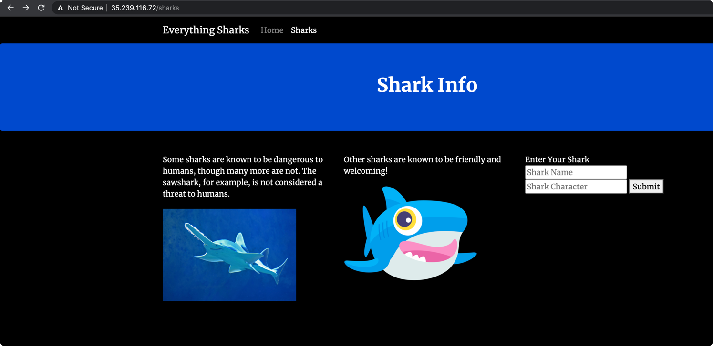
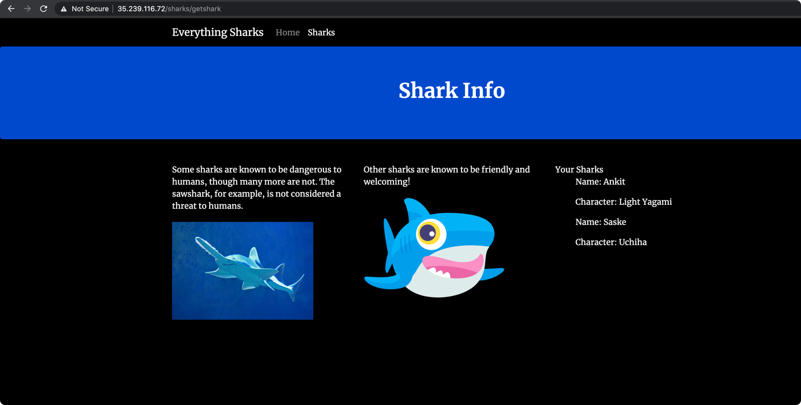

### Nodejs Mongo Application on kubernetes GCP

[docs](https://www.digitalocean.com/community/tutorials/how-to-migrate-a-docker-compose-workflow-to-kubernetes)

- Build Project

```bash
$ docker build -t codeaprendiz/node-kubernetes .  
```

- Docker Login

```bash
$ docker login -u codeaprendiz                  
Password: 
Login Succeeded
```

- Push the image

```bash
$ docker push codeaprendiz/node-kubernetes                                    
```


- Create secrets


```bash
$ kubectl create secret generic mongo-secret --from-literal=MONGO_USERNAME=admin --from-literal=MONGO_PASSWORD=password --dry-run=client -o yaml
apiVersion: v1
data:
  MONGO_PASSWORD: cGFzc3dvcmQ=
  MONGO_USERNAME: YWRtaW4=
kind: Secret
metadata:
  creationTimestamp: null
  name: mongo-secret
```


- Set up a k8s cluster on GCP

```bash
$ kubectl get storageclass
NAME                 PROVISIONER             RECLAIMPOLICY   VOLUMEBINDINGMODE      ALLOWVOLUMEEXPANSION   AGE
premium-rwo          pd.csi.storage.gke.io   Delete          WaitForFirstConsumer   true                   3m6s
standard (default)   kubernetes.io/gce-pd    Delete          Immediate              true                   3m6s
standard-rwo         pd.csi.storage.gke.io   Delete          WaitForFirstConsumer   true                   3m6s
```

- Create resources

```bash
$ kubectl apply -f .
deployment.apps/db created
service/db created
persistentvolumeclaim/dbdata created
deployment.apps/nodejs created
configmap/nodejs-env created
service/nodejs created
secret/mongo-secret created

$ kubectl get pods
NAME                      READY   STATUS              RESTARTS   AGE
db-78d59f4dd6-5wcnn       0/1     ContainerCreating   0          15s
nodejs-6b55db9445-jtqg4   0/1     Init:0/1            0          14s

$ kubectl get svc
NAME         TYPE           CLUSTER-IP   EXTERNAL-IP   PORT(S)        AGE
db           ClusterIP      10.8.4.245   <none>        27017/TCP      21s
kubernetes   ClusterIP      10.8.0.1     <none>        443/TCP        36m
nodejs       LoadBalancer   10.8.10.40   <pending>     80:30248/TCP   20s

$ kubectl get pods
NAME                      READY   STATUS    RESTARTS   AGE
db-78d59f4dd6-5wcnn       1/1     Running   0          49s
nodejs-6b55db9445-jtqg4   1/1     Running   0          48s

$ kubectl logs -f nodejs-6b55db9445-jtqg4
Example app listening on 8080!
MongoDB is connected

$ kubectl get svc
NAME         TYPE           CLUSTER-IP   EXTERNAL-IP     PORT(S)        AGE
db           ClusterIP      10.8.4.245   <none>          27017/TCP      5m49s
kubernetes   ClusterIP      10.8.0.1     <none>          443/TCP        42m
nodejs       LoadBalancer   10.8.10.40   35.239.116.72   80:30248/TCP   5m48s
```

- Accessing the application

  - Home page


  - Get Shark Info Page
  


  - After adding sharks
  



