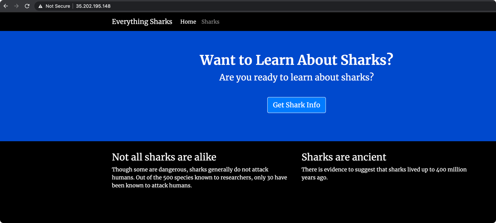
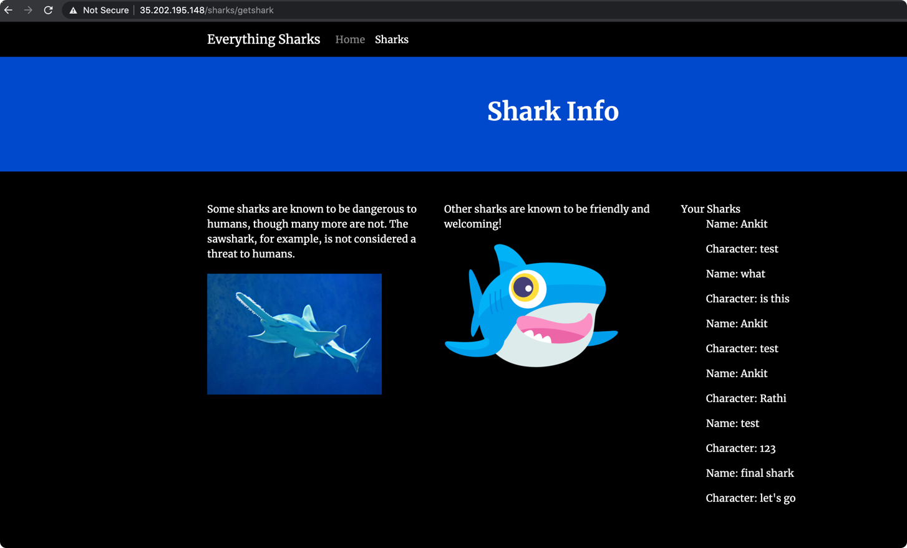

### Objectives

[Referred - doc](https://www.digitalocean.com/community/tutorials/how-to-scale-a-node-js-application-with-mongodb-on-kubernetes-using-helm)


Tasks |   Exit Criteria | Status |
---    | --- | --- | 
Nodejs Mongo App | Create an application with Nodejs with Mongo as database | Done
Clean Dockerfile | Try to optimize the Dockerfile by removing all unnecessary cache/files to reduce the image size. | Done
Docker Image Size | Remove caches | Done
docker-compose up  | docker-compose up runs the app locally | Done | 
kubernetes resources | You should have all k8s resources | Done | 
Health checks on pods | Health check probes like /healthz or any other | Done
Automatic Scaling | No of pods should increase if load increases | Done
Use Config Maps for environments vars | Use config maps for env vars | Done
Use Secrets for passwords | Use secrets for passwords | Done
Have declarative resource limits in pods | Define resource limits in pods | Done
MongoDB replicaset | Ensure that you are using mongodb replicaset for high availability | Done
Persistence Volume Claim | Ensure that you are using persistent volume claim in k8s for the mongodb database | Done
Use Helm to create template | Use helm charts for node and mongo | Done
Use Load Balancer as Ingress | Use load balancer as ingress | Done
Use Nginx/traefik as Ingress if not Load Balancer |  | 
Security | Removing unnecessary binaries/permissions to improve container security is a huge plus. |  

### Nodejs Mongo App

We are using node `v15.8.0` and mongodb to run the application

### Clean Dockerfile and Docker Image Size

We are not mounting the folder `node_modules` to the container so the docker-image size is greatly reduced.


### docker-compose up

- Edit the db.js and change the connnection URI to use the non-replica set URL as we are running it locally
- The following is the successful run of the app, adding one document to the DB
```bash
$ docker-compose up  
Creating network "node_project_app-network" with driver "bridge"
Creating db     ... done
Creating nodejs ... done
Attaching to db, nodejs
.
.
db        | 2021-02-25T18:32:06.552+0000 I ACCESS   [conn2] Successfully authenticated as principal sammy on admin
nodejs    | MongoDB is connected
nodejs    | { name: 'Ankit', character: 'Rathi' }
db        | 2021-02-25T18:32:35.950+0000 I SHARDING [conn2] Marking collection sharkinfo.sharks as collection version: <unsharded>
```

- change the connection URI to default again


- build image using

```bash
$ docker build -t codeaprendiz/node-replicas .  
```

- login to dockerhub

```bash
$ docker login -u codeaprendiz                
Password: 
Login Succeeded
```

- push the image

```bash
$ docker push codeaprendiz/node-replicas  
```

- create secret for mongo

```bash
$ kubectl create secret generic mongo-secret --from-literal=mongodb-root-password=password --from-literal=mongodb-replica-set-key=key123 --dry-run=client -o yaml
apiVersion: v1
data:
  mongodb-replica-set-key: a2V5MTIz
  mongodb-root-password: cGFzc3dvcmQ=
kind: Secret
metadata:
  creationTimestamp: null
  name: mongo-secret
```

- Ensure that you have a storage class in your k8s cluster

- Create the values file mongodb-values.yaml

- Add stable version of the mongodb-replicaset chart 

  - [Referred stackoverflow](https://stackoverflow.com/questions/57970255/helm-v3-cannot-find-the-official-repo)
  - [bitnami/mongodb](https://github.com/bitnami/charts/tree/master/bitnami/mongodb)
  - [values.yam](https://github.com/bitnami/charts/blob/master/bitnami/mongodb/values.yaml)

```bash
$ helm version                  
version.BuildInfo{Version:"v3.5.2", GitCommit:"167aac70832d3a384f65f9745335e9fb40169dc2", GitTreeState:"dirty", GoVersion:"go1.15.7"}

$ helm repo add stable https://charts.helm.sh/stable
"stable" has been added to your repositories

$ helm repo add bitnami https://charts.bitnami.com/bitnami
"bitnami" has been added to your repositories

$ helm repo update                                                                                   
Hang tight while we grab the latest from your chart repositories...
...Successfully got an update from the "bitnami" chart repository
...Successfully got an update from the "stable" chart repository
Update Complete. ⎈Happy Helming!⎈


## Lets create the templates
$ helm template mongo1 -f mongodb-values.yaml bitnami/mongodb > resources-db.yaml
```


- Let's deploy mongodb on k8s cluster and check if its working as expected

```bash
$ kubectl create secret generic mongo-secret --from-literal=mongodb-root-password=password --from-literal=mongodb-replica-set-key=key123
secret/mongo-secret created
$ kubectl apply -f resources-db.yaml
serviceaccount/mongo-mongodb created
configmap/mongo-mongodb-scripts created
service/mongo-mongodb-arbiter-headless created
service/mongo-mongodb-headless created
statefulset.apps/mongo-mongodb-arbiter created
statefulset.apps/mongo-mongodb created
$ kubectl get pods
NAME                      READY   STATUS              RESTARTS   AGE
mongo-mongodb-0           0/1     ContainerCreating   0          4s
mongo-mongodb-arbiter-0   0/1     Running             0          4s
$ kubectl get pods
NAME                      READY   STATUS    RESTARTS   AGE
mongo-mongodb-0           1/1     Running   0          38s
mongo-mongodb-1           0/1     Running   0          11s
mongo-mongodb-arbiter-0   1/1     Running   0          38s
$ kubectl exec -it mongo-mongodb-0 -- sh
$ hostname
mongo-mongodb-0
$ mongo --host mongo-mongodb-0.mongo-mongodb-headless.default.svc.cluster.local --username=root --password=password
MongoDB shell version v4.4.4
connecting to: mongodb://mongo-mongodb-0.mongo-mongodb-headless.default.svc.cluster.local:27017/?compressors=disabled&gssapiServiceName=mongodb
Implicit session: session { "id" : UUID("4fff93b7-95e6-4150-a69d-a8078b03a870") }
MongoDB server version: 4.4.4
---
The server generated these startup warnings when booting:
        2021-02-25T19:16:56.215+00:00: Using the XFS filesystem is strongly recommended with the WiredTiger storage engine. See http://dochub.mongodb.org/core/prodnotes-filesystem
---
---
        Enable MongoDB's free cloud-based monitoring service, which will then receive and display
        metrics about your deployment (disk utilization, CPU, operation statistics, etc).

        The monitoring data will be available on a MongoDB website with a unique URL accessible to you
        and anyone you share the URL with. MongoDB may use this information to make product
        improvements and to suggest MongoDB products and deployment options to you.

        To enable free monitoring, run the following command: db.enableFreeMonitoring()
        To permanently disable this reminder, run the following command: db.disableFreeMonitoring()
---
db:PRIMARY>
```

So our database is working! :)


- Creating Custom Application Chart and Configuring parameters

```bash
$ helm create nodeapp
Creating nodeapp
```


- Add the following data to the configmap


```yaml
MONGO_HOSTNAME: "mongo-mongodb-0.mongo-mongodb-headless.default.svc.cluster.local,mongo-mongodb-1.mongo-mongodb-headless.default.svc.cluster.local,mongo-mongodb-2.mongo-mongodb-headless.default.svc.cluster.local"
MONGO_PORT: "27017"
MONGO_DB: "sharkinfo"
MONGO_REPLICASET: "db"
```

- Update our secret with more required values

```bash
$ kubectl create secret generic mongo-secret \
--from-literal=mongodb-root-password=password \
--from-literal=mongodb-replica-set-key=key123  \
--from-literal=MONGO_USERNAME=root \
--from-literal=MONGO_PASSWORD=password \
--dry-run=client -o yaml
apiVersion: v1
data:
  MONGO_PASSWORD: cGFzc3dvcmQ=
  MONGO_USERNAME: cm9vdA==
  mongodb-replica-set-key: a2V5MTIz
  mongodb-root-password: cGFzc3dvcmQ=
kind: Secret
metadata:
  creationTimestamp: null
  name: mongo-secret
```

- Generate the yaml's for the application

```bash
$ helm template app ./nodeapp > resources-app.yaml
```


#### How to deploy the application

- create secret

```bash
$ kubectl apply -f secret.yaml
secret/mongo-secret created
```

- Deploy the database resources first
```bash
$ kubectl apply -f resources-db.yaml
serviceaccount/mongo-mongodb created
configmap/mongo-mongodb-scripts created
service/mongo-mongodb-arbiter-headless created
service/mongo-mongodb-headless created
statefulset.apps/mongo-mongodb-arbiter created
statefulset.apps/mongo-mongodb created

$ kubectl get pods
NAME                      READY   STATUS    RESTARTS   AGE
mongo-mongodb-0           1/1     Running   0          93s
mongo-mongodb-1           1/1     Running   0          62s
mongo-mongodb-2           1/1     Running   0          42s
mongo-mongodb-arbiter-0   1/1     Running   0          93s
```

- Once db is up, deploy the app

```bash
$ kubectl apply -f resources-app.yaml
serviceaccount/app-nodeapp created
secret/app-auth created
configmap/app-config created
service/app-nodeapp created
deployment.apps/app-nodeapp created
horizontalpodautoscaler.autoscaling/app-nodeapp created
pod/app-nodeapp-test-connection created


### Note that there is only one pod duo to auto-scaling enabled (HPA). Ignore the app-nodeapp-test-connection. Please.
$ kubectl get pods
NAME                           READY   STATUS    RESTARTS   AGE
app-nodeapp-6dfc8c56b6-cblvn   1/1     Running   0          102s
app-nodeapp-test-connection    0/1     Error     0          102s
mongo-mongodb-0                1/1     Running   0          3m30s
mongo-mongodb-1                1/1     Running   0          2m59s
mongo-mongodb-2                1/1     Running   0          2m39s
mongo-mongodb-arbiter-0        1/1     Running   0          3m30s

$ kubectl logs -f app-nodeapp-6dfc8c56b6-cblvn
Example app listening on 8080!
MongoDB is connected

$ kubectl get svc
NAME                             TYPE           CLUSTER-IP   EXTERNAL-IP      PORT(S)        AGE
app-nodeapp                      LoadBalancer   10.8.2.120   35.202.195.148   80:31304/TCP   3m54s
kubernetes                       ClusterIP      10.8.0.1     <none>           443/TCP        10h
mongo-mongodb-arbiter-headless   ClusterIP      None         <none>           27017/TCP      5m42s
mongo-mongodb-headless           ClusterIP      None         <none>           27017/TCP      5m42s
```


#### Screenshots

- Homepage




- Add shark


- After adding shark

