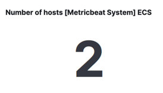
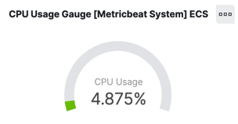
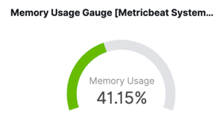
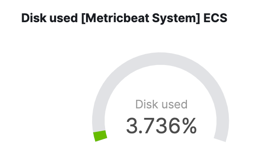
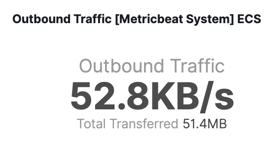

# System - Monitoring


| Stats                                                         | Visualization                                 |
|---------------------------------------------------------------|-----------------------------------------------|
| [Number of hosts](#Number-of-hosts)                           |               | 
| [CPU Usage Guage](#CPU-Usage-Gauge)                           |               | 
| [Memory Usage Gauge](#Memory-Usage-Gauge)                     |            | 
| [Disk used](#Disk-used)                                       |                     | 
| [Inbound Traffic](#Inbound-Traffic)                           |               | 
| [Outbound Traffic](#Outbound-Traffic)                         |              | 
| [Top Hosts By CPU Realtime](#Top-Hosts-By-CPU-Realtime)       |     | 
| [Top Hosts By Memory Realtime](#Top-Hosts-By-Memory-Realtime) |  | 
| [Host histogram by CPU usage](#Hosts-histogram-by-CPU-usage)  |   |


### Number-of-hosts

Metrics

```bash
## UniqueCount ##
a = UniqueCount(host.name)
```

### CPU-Usage-Gauge

- system.cpu.user.pct: 
  - The percentage of CPU time spent in user space. On multi-core systems, you can have percentages that are greater than 100%. For example, if 3 cores are at 60% use, then the system.cpu.user.pct will be 180%. 
  - type: scaled_float
  - format: percent
  
- system.cpu.system.pct
  - The percentage of CPU time spent in kernel space.
  - type: scaled_float
  - format: percent

- system.cpu.cores
  - The number of CPU cores present on the host. The non-normalized percentages will have a maximum value of 100% * cores. The normalized percentages already take this value into account and have a maximum value of 100%.
  - type: long

**Aggregations**

- Timefield : @timestamp
- Inverval : auto
- Data timerange mode : last value

```bash
## Average ##
user = Avg(system.cpu.user.pct)

## Average ##
system = Avg(system.cpu.system.pct)

## Average ##
n = Avg(system.cpu.cores)

## Bucket Script ##
params.n > 0 ? (params.user+params.system)/params.n : null

GroupBy-Everything
```


| COLOR          |EXPRESSION                     |VALUE                        |
|----------------|-------------------------------|-----------------------------|
|GREEN           |: >= greater than or equal     |0                            |
|ORANGE          |: >= greater than or equal     |0.7                          |
|RED             |: >= greater than or equal     |0.85                         |

### Memory-Usage-Gauge

- system.memory.actual.used.pct
    - The percentage of actual used memory. 
    - type: scaled_float
    - format: percent
    

**Aggregation**

- Timefield : @timestamp
- Inverval : auto
- Data timerange mode : last value

```bash
## Average ##
a = Avg(system.memory.actual.used.pct)

GroupBy-Everything
```

| COLOR          |EXPRESSION                     |VALUE                        |
|----------------|-------------------------------|-----------------------------|
|GREEN           |: >= greater than or equal     |0                            |
|ORANGE          |: >= greater than or equal     |0.7                          |
|RED             |: >= greater than or equal     |0.85                         |


### Disk-used

- system.fsstat.total_size.used
  - Total used space.
  - type: long
  - format: bytes
  
- system.fsstat.total_size.total
  - Total space (used plus free).
  - type: long
  - format: bytes
 
**Aggregation**

- Dataformatter : Percent
- Data timerange mode : last value

```bash
## TopHit ##
a = TopHit(system.fsstat.total_size.used)         # Size=1, Aggregate with Avg, Order By : @timastamp, Desc

## TopHit ##
b = TopHit(system.fsstat.total_size.total)        # Size=1, Aggregate with Avg, Order By : @timastamp, Desc

Expression = a/b

GroupBy-Everything
```


| COLOR          |EXPRESSION                     |VALUE                        |
|----------------|-------------------------------|-----------------------------|
|GREEN           |: >= greater than or equal     |0                            |
|ORANGE          |: >= greater than or equal     |0.7                          |
|RED             |: >= greater than or equal     |0.85                         |


### Inbound-Traffic

*network*  network contains network IO metrics for a single network interface.

- system.network.in.bytes
    - The number of bytes received.

- system.network.name
  - The network interface name.
  - type: keyword
  - example: eth0
  
**Aggregation**
  
- Timefield : @timestamp
- Inverval : auto
- Data timerange mode : last value
  
```bash
## Max ##
a = Max(system.network.in.bytes)

## Derivative ##
b = Derivative(a)/1s

## PositiveOnly ##
c = PositiveOnly(b)

## Series Agg ##
Function : Sum             # c1 + c2 + c3 ....

GroupBy-Terms : system.network.name
Top : 10
OrderBy : Doc Count (default)
Decending
```


  
#### Total Transferred

**Aggregation**
  
- Dataformatter : Bytes
- Template : {{value}}         
- Data timerange mode : last value

```bash
## Max ##
a = Max(system.network.in.bytes)

## Derivative ##
b = Derivative(a)/1s

## PositiveOnly ##
c = PositiveOnly(b)

## Series Agg ##
Function : Overall Sum             # c1 + c2 + c3 ....

GroupBy-Terms : system.network.name
Top : 10
OrderBy : Doc Count (default)
Decending
```

### Outbound-Traffic


- system.network.out.bytes
    - The number of bytes sent.
    - type: long
    - format: bytes

**Aggregation**
  
- Timefield : @timestamp
- Inverval : auto
- Data timerange mode : last value
  
```bash
## Max ##
a = Max(system.network.out.bytes)

## Derivative ##
b = Derivative(a)/1s

## PositiveOnly ##
c = PositiveOnly(b)

## Series Agg ##
Function : Sum             # c1 + c2 + c3 ....

GroupBy-Terms : system.network.name
Top : 10
OrderBy : Doc Count (default)
Decending
```

#### Total Transferred

- system.network.name
  - The network interface name.
  - type: keyword
  - example: eth0

**Aggregation**
  
- Dataformatter : Bytes
- Template : {{value}}         
- Data timerange mode : last value

```bash
## Max ##
a = Max(system.network.out.bytes)

## Derivative ##
b = Derivative(a)/1s

## PositiveOnly ##
c = PositiveOnly(b)

## Series Agg ##
Function : Overall Sum             # c1 + c2 + c3 ....

GroupBy-Terms : system.network.name
Top : 10
OrderBy : Doc Count (default)
Decending
```

### Top-Hosts-By-CPU-Realtime

- system.cpu.user.pct
  - The percentage of CPU time spent in user space. On multi-core systems, you can have percentages that are greater than 100%. For example, if 3 cores are at 60% use, then the system.cpu.user.pct will be 180%.
  - type: scaled_float
  - format: percent

**Aggregation**

- Timefield : @timestamp
- Inverval : auto
- Data timerange mode : last value

```bash
## Average ##
a = Avg(system.cpu.user.pct)

GroupBy-Terms : host.name
Top : 10
Order by : a
Desc
```

| COLOR          |EXPRESSION                     |VALUE                        |
|----------------|-------------------------------|-----------------------------|
|GREEN           |: >= greater than or equal     |0                            |
|ORANGE          |: >= greater than or equal     |0.6                          |
|RED             |: >= greater than or equal     |0.85                         |


### Top-Hosts-By-Memory-Realtime

- system.memory.actual.used.pct
    - The percentage of actual used memory. 
    - type: scaled_float
    - format: percent

**Aggregation**

- Timefield : @timestamp
- Inverval : auto
- Data timerange mode : last value

```bash
## Average ##
a = Avg(system.memory.actual.used.pct)

GroupBy-Terms : host.name
Top : 10
Order by : a
Desc
```

| COLOR          |EXPRESSION                     |VALUE                        |
|----------------|-------------------------------|-----------------------------|
|GREEN           |: >= greater than or equal     |0                            |
|ORANGE          |: >= greater than or equal     |0.6                          |
|RED             |: >= greater than or equal     |0.85                         |


### Hosts-histogram-by-CPU-usage

- system.cpu.user.pct
  - The percentage of CPU time spent in user space. On multi-core systems, you can have percentages that are greater than 100%. For example, if 3 cores are at 60% use, then the system.cpu.user.pct will be 180%.
  - type: scaled_float
  - format: percent
  
**Metrics**
```bash
Value Average(system.cpu.user.pct)
```

**Buckets**
```bash
## X-axis ##
@timestamp per 30 seconds

## Y-axis ##
host.name: Descending
```
